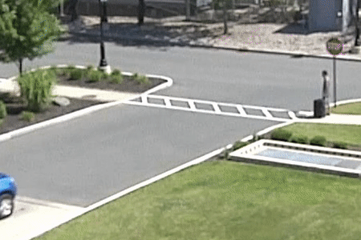
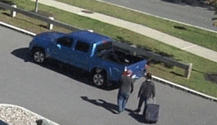
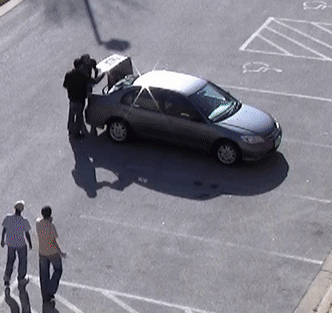
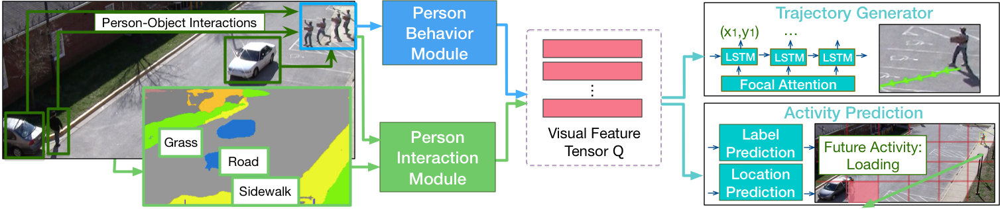

# Next

This repository contains the code and models for the following paper:


**[Peeking into the Future: Predicting Future Person Activities and Locations in Videos](https://arxiv.org/abs/1902.03748)** \
[Junwei Liang](https://www.cs.cmu.edu/~junweil/),
[Lu Jiang](http://www.lujiang.info/),
[Juan Carlos Niebles](http://www.niebles.net/),
[Alexander Hauptmann](https://www.cs.cmu.edu/~alex/),
[Li Fei-Fei](http://vision.stanford.edu/feifeili/) \
[CVPR 2019](http://cvpr2019.thecvf.com/)

You can find more information at our [Project Page](https://next.cs.cmu.edu/).\
*Please note that this is not an officially supported Google product.*

+ *[11/2022] CMU server is down. You can replace all `https://next.cs.cmu.edu` with `https://precognition.team/next/` to download necessary resources.*
+ *[02/2020] [New paper](https://next.cs.cmu.edu/multiverse/) on multi-future trajectory prediction is accepted by CVPR 2020.*

If you find this code useful in your research then please cite

```
@InProceedings{Liang_2019_CVPR,
  author = {Liang, Junwei and Jiang, Lu and Carlos Niebles, Juan and Hauptmann, Alexander G. and Fei-Fei, Li},
  title = {Peeking Into the Future: Predicting Future Person Activities and Locations in Videos},
  booktitle = {The IEEE Conference on Computer Vision and Pattern Recognition (CVPR)},
  month = {June},
  year = {2019}
}
```


## Introduction
In applications like self-driving cars and smart robot assistant it is important
for a system to be able to predict a person's future locations and activities.
In this paper we present an end-to-end neural network model that
**deciphers human behaviors** to predict their future paths/trajectories and
their future activities jointly from videos.

Below we show an example of the task. The green and yellow line show two
possible future trajectories and two possible activities are shown in the
green and yellow boxes. Depending on the future activity,
the target person(top right) may take different paths,
e.g. the yellow path for “loading” and the green path for “object transfer”.

<div align="center">
  
  <br/>
  <div style="">
      
      
      
  </div>
  <p style="font-weight:bold;font-size:1.2em;">
  	<a href="http://www.youtube.com/watch?feature=player_embedded&v=NyrGxGoS01U" target="_blank">Demo Video</a>
    &nbsp;&nbsp;&nbsp;&nbsp;
    <a href="EXAMPLES.md" target="_blank">More Examples</a>
  </p>
</div>

## Model
Given a sequence of video frames containing the person for prediction,
our model utilizes person behavior module and person interaction module
to encode rich visual semantics into a feature tensor.
We propose novel person interaction module that takes into account both
person-scene and person-object relations for joint activities
and locations prediction.
<div align="center">
  
</div>

## Dependencies
+ Python 2.7; TensorFlow == 1.10.0 (Should also work on 1.14+)
+ [10/2020] Now it is compatible with Python 3.6 and Tensorflow 1.15

## Pretrained Models
You can download pretrained models by running the script
`bash scripts/download_single_models.sh`.
This will download the following models, and will require
about 5.8 GB of disk space:

- `next-models/actev_single_model/`: This folder
includes single model for the ActEv experiment.
- `next-models/ethucy_single_model/`: This folder includes five single
models for the ETH/UCY leave-one-scene-out experiment.

## Testing
Instructions for testing pretrained models can be [found here](TESTING.md).

## Training new models
Instructions for training new models can be [found here](TRAINING.md).

## Preparing Rich Visual Features
Instructions for extracting features can be [found here](https://github.com/JunweiLiang/next-prediction/blob/master/code/prepare_data/README.md).

## Acknowledgments
The preprecessing code and evaluation code for trajectories were adapted from [Social-GAN](https://github.com/agrimgupta92/sgan).

## PyTorch Implementation
Checkout this [repo](https://github.com/HRHLALALA/next-prediction-pytorch) based on PyTorch by [HRHLALALA](https://github.com/HRHLALALA).

